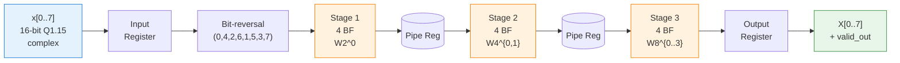
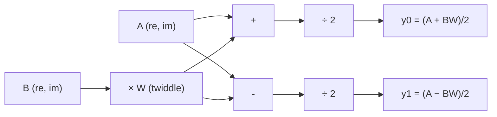
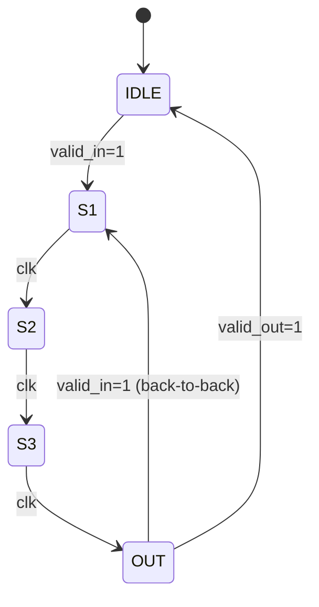

# Sơ đồ minh họa — Báo cáo FFT 8-point

## 1. Block diagram tổng thể (Mermaid)



---

## 2. Butterfly Radix-2 DIT (Mermaid)



---

## 3. Signal flow graph 8-point DIT (text art)

```
n=0 ●─────────●─────────●─────────●  X[0]
              │ \      /│ \      /│
n=4 ●─[W8^0]──●  \    / ●  \    / ●  X[4]
              │   \  /   │   \  /
n=2 ●─────────●────X─────●────X────●  X[2]
              │ \  / \  /│ \  / \ │
n=6 ●─[W8^0]──●  X    X  ●  X    X●  X[6]
              │ / \  / \ │ / \  / \
n=1 ●─────────●────X─────●────X────●  X[1]
              │ \  / \  /│ \  / \ │
n=5 ●─[W8^0]──●  /    \  ●  /    \●  X[5]
              │ /      \ │ /      \
n=3 ●─────────●─────────●─────────●  X[3]
              │ /      \ │ /      \│
n=7 ●─[W8^0]──●─────────●─────────●  X[7]

  Stage 1     Stage 2      Stage 3
  W2^0        W4^{0,1}     W8^{0..3}
```

---

## 4. State diagram pipeline (Mermaid)



---

## 5. Timing diagram (Wavedrom-style ASCII)

```
clk        ┌─┐ ┌─┐ ┌─┐ ┌─┐ ┌─┐ ┌─┐ ┌─┐
         ──┘ └─┘ └─┘ └─┘ └─┘ └─┘ └─┘ └─┘──
valid_in   ┌───┐
         ──┘   └─────────────────────────
x_in       │ x │
         ──┴───┴─────────────────────────
                              ┌───┐
valid_out ───────────────────┘   └─────
                              │ X │
X_out    ─────────────────────┴───┴─────

           cycle 0  1  2  3  4
                    └─ latency 4 cycles ─┘
```

---

## 6. Q1.15 fixed-point format

```
 Bit:  15 14 13 12 11 10  9  8  7  6  5  4  3  2  1  0
       ┌──┬──┬──┬──┬──┬──┬──┬──┬──┬──┬──┬──┬──┬──┬──┬──┐
       │S │·15·14·13·12·11·10 ·9 ·8 ·7 ·6 ·5 ·4 ·3 ·2 ·1│
       └──┴──┴──┴──┴──┴──┴──┴──┴──┴──┴──┴──┴──┴──┴──┴──┘
       sign  └─────────── 15 fractional bits ────────────┘

Range: [-1.0, +1.0)   LSB = 1/32768 ≈ 30.5 μ
```

---

## 7. Twiddle factor unit circle

```
                    Im
                    ↑
                    │
              W8^6  │  W8^7
                ●   │   ●
            ●       │       ●
          W8^5      │      W8^0
        ●           │           ● → Re
          W8^4      │      W8^1
            ●       │       ●
                ●   │   ●
              W8^3  │  W8^2
                    │
                    ↓

W8^0 = (1, 0)
W8^1 = (0.707, -0.707)
W8^2 = (0, -1)
W8^3 = (-0.707, -0.707)
W8^4 = (-1, 0)         (= -W8^0)
W8^5 = (-0.707, 0.707) (= -W8^1)
W8^6 = (0, 1)          (= -W8^2)
W8^7 = (0.707, 0.707)  (= -W8^3)
```

Chỉ cần 4 hệ số đầu, các hệ số khác lấy phần đối dấu.
